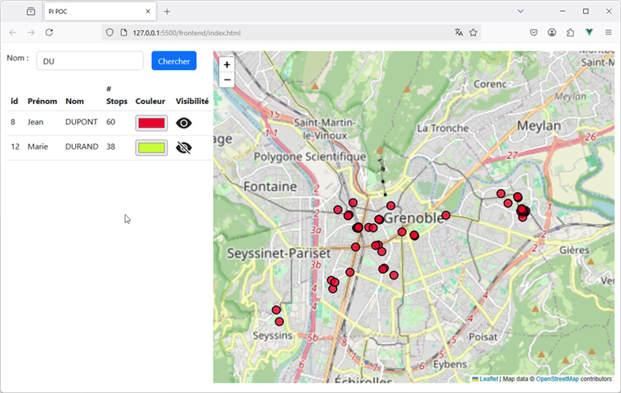

# POC (Proof Of Concepts) pour le projet d'intégration

Ce projet contient le code pour une application servant de preuve de concepts (POC ou Proof Of concepet) pour le projet d'intégration du M2 CCI/M2 GEOMAS. Il contient 4 dossiers :

- **bd** : ce dossier regroupe les scripts de création de la base de données [PostgreSQL](https://www.postgresql.org/)/[PostGIS](https://postgis.net/). 
    - le script **createSchema.sql** crée un schema <kbd>test_pi</kbd> 
       et dans ce schema les deux tables <kbd>participants</kbd> et <kbd>stops</kbd>.
    - le script **createData.sql**  permet d'insérer les données dans les tables.
- **backend** : ce dossier contient le code source du backend ([Springboot](https://spring.io/projects/spring-boot)/Java) qui permet d'offrir une API REST pour l'accès aux données de la base
- **frontend** : ce dossier contient le code source du front-end (il utilise [Leaflet](https://leafletjs.com/) pour le web Mapping et Vue3)
- **docker** : ce dossier le fichier **docker-compose.yaml** qui permet d’exécuter deux containers docker avec une image pour PostgreSQL et image pour PGAdmin

Pour pouvoir exécuter cette application il faut :

1. vous connecter à votre base de donnés (par exemple avec le client pgadmin) et exécuter les scripts **createSchema.sql** puis **createData.sql** situés dans le dossier bd. Vous trouverez [ICI](https://lig-membres.imag.fr/genoud/teaching/PL2AI/tds/PI/sujets/PI_POC/PI_POC.html#section02) des explications sur comment vous connecter à la base Postgres/PostGIS de l'IUGA et y créer le schéma 
<strong>test_pi</strong> utilisé par cette application (à venir des explications sur comment se connecter à une base locale gérée avec un conteneur docker).
3. Si vous utilisez une base de données autre que la base PostgreSQL de l'IUGA (par exemple un base locale) modifier le fichier **application.properties** situé dans le back-end (chemin d'accès `backend/src/main/resources`) afin 
d'accéder à votre base de données (voir les indications en commentaire dans ce fichier).
4. lancer le serveur back-end en exécutant le *main* de la classe  **SpringjdbcApplication** (situé dans `main/java`) et si vous utilisez la base de données de l'IUGA renseignez vos identifiants de connexion (login et mot de passe)
5. ouvrir avec LiveServer la page **index.html** du front-end

Des explications détaillées sur l'installation et l'exécution de cette application sont disponibles à l'url https://lig-membres.imag.fr/genoud/teaching/PL2AI/tds/PI/sujets/PI_POC/PI_POC.html

